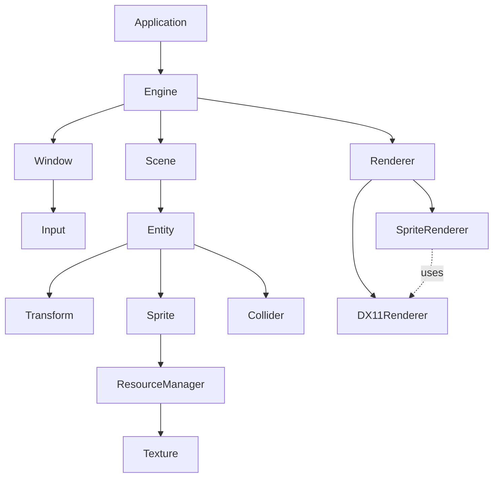

# Basic2DGameEngine
Vive coding project with "Game Engine Architecture 3rd Edition".

# Basic2DGameEngine

## Overview

C++ / WinAPI / DirectX 11 based
Vive coding basic 2D game engine project with "Game Engine Architecture 3rd Edition".

## Features

- WinAPI Window System
- Game Loop / Delta Time
- DirectX 11 Renderer
- Sprite Rendering
- Texture Loading
- Alpha Blending
- Resource Caching
- Scene / Entity System
- Camera
- Input
- AABB Collision
- Debug Collider Visualization

## Architecture

[Architecture Diagram]

## Rendering Pipeline

Sprite
→ Vertex Buffer
→ Vertex Shader
→ Pixel Shader
→ Alpha Blend
→ Render Target

## Scene System

Scene
→ Entity
→ Transform / Sprite / Collider

## Resource Management

Path
→ Cache
→ Texture

## Demo

WASD Movement
Enemy Chase
Space Attack
Camera Follow

## Debugging

F1: Collider Toggle

## Known Limitations

- DX11 backend dependency
- No editor
- No ECS
- No batching
- Runtime shader compilation

## Future Work

- GraphicsDevice abstraction
- Sprite batching
- Animation system
- Tilemap
